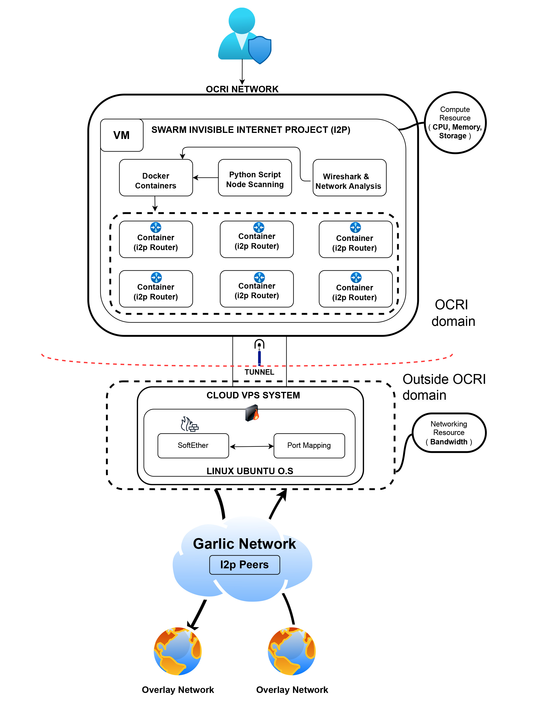
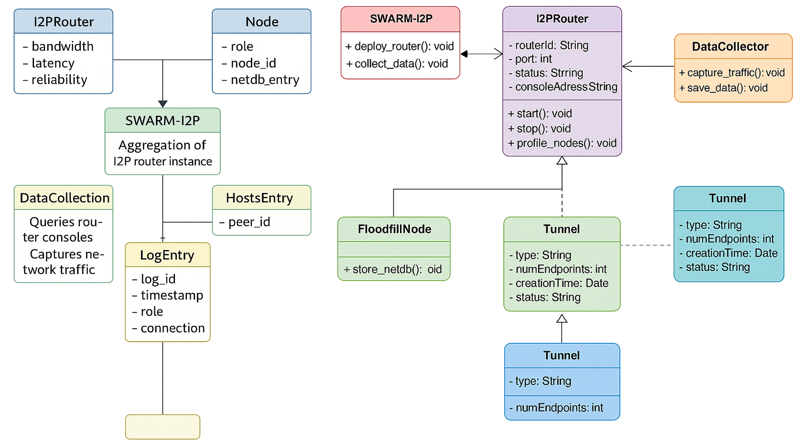

# Mapping the Invisible Internet (SWARM-I2P)

<p align="center">
  
</p>

Large-scale deployment framework, data-collection scripts, and links to the publicly released dataset that maps the **network layer** of the Invisible Internet Project (I2P).

---

<p align="center">
  <a href="https://doi.org/10.5281/zenodo.15369068"></a>
  <a href="#license"></a>
  <a href="#citation"></a>
</p>

## TL;DR

* **What:** Scripts + framework (SWARM-I2P) for deploying hundreds of I2P routers and collecting **network-layer** telemetry at scale.
* **Data:** >50k nodes observed; **FastSet**: 2,077; **High-capacity**: 2,331; latency \~121.21±48.50 ms; capacity \~8.57±1.20; multi-million traffic records.
* **Why:** Enable studies of tunnel peer selection, network resilience, centrality, and adversarial modeling at the router layer (not just eepsites).
* **Where:** Open dataset on Zenodo; collection scripts and reproducible configs here.

---

## Table of contents

1. [Overview](#overview)
2. [Repository layout](#repository-layout)
3. [Prerequisites](#prerequisites)
4. [Quick start](#quick-start)
5. [Configuration](#configuration)
6. [Collecting data](#collecting-data)
7. [What’s in the dataset](#whats-in-the-dataset)
8. [Analysis starters](#analysis-starters)
9. [Reproducibility & ethics](#reproducibility--ethics)
10. [Citing & DOI](#citation)
11. [Acknowledgments](#acknowledgments)
12. [License](#license)

---

## Overview

**SWARM-I2P** is a deployment and measurement framework that uses Docker-containerized I2P routers—optionally elevated to **floodfill**—to observe tunnel formation and peer selection across the I2P network.

Key ideas:

* **Dynamic port mapping (30,000–50,000)** to run many routers on one host while exposing standard I2P internals (e.g., 7657 web console, 4444 HTTP proxy) inside each container.
* **Hybrid lab/field setup:** local VMs (e.g., OCRI/University resources) bridged with cloud VPS through **SoftEther VPN**, enabling controlled measurement with Internet realism.
* **Minute-level polling** of each router’s console (`/tunnels`) + profile directories (`hosts.txt`, `.i2p/netDb`) to track active tunnels, roles, and peer performance.
* **Passive traffic capture** (Wireshark/tcpdump) on the VPN interface for metadata only (no content), plus router-computed performance metrics.

> The accompanying **Zenodo dataset** contains CSV/TXT exports ready for Pandas/R and includes country, speed, capacity, roles, and selection frequencies for peer nodes.

---

## Repository layout

<p align="center">
  
</p>

> *If your folder names differ, keep this section as a guide and adjust paths in examples.*


---

## Prerequisites

* Linux host (tested on **Ubuntu 24.04 LTS**)
* **Docker** + **Docker Compose** (Portainer optional but handy)
* (Optional) **SoftEther VPN** server/bridge if you’re reproducing the hybrid lab–cloud topology
* `ufw` (or equivalent) to allow and persist port ranges you map to containers

---

## Quick start

1. **Clone** the repository

   ```bash
   git clone https://github.com/<your-org>/<your-repo>.git
   cd <your-repo>
cp config/.env.sample .env
# set ROUTER_COUNT, PORT_RANGE_START=30000, PORT_RANGE_END=50000, etc.

docker compose up -d

services:
  i2p-router:
    build: ./docker/i2p
    deploy:
      replicas: ${ROUTER_COUNT:-10}
    environment:
      I2P_FLOODFILL: "${FLOODFILL:-false}"
    ports:
      # example: programmatically allocate host ports 30000–50000 to container internals
      - "${HTTP_CONSOLE_PORT:-40137}:7657"   # I2P console
      - "${HTTP_PROXY_PORT:-40444}:4444"    # HTTP proxy
    volumes:
      - i2pdata:/home/i2p/.i2p
    restart: unless-stopped
volumes:
  i2pdata:


python scripts/collect_tunnels.py \
  --interval 60 \
  --console http://127.0.0.1:<HTTP_CONSOLE_PORT>/tunnels \
  --profiles /home/i2p/.i2p


sudo tcpdump -i <vpn_nic> -w captures/swarmi2p.pcap


import pandas as pd
ct = pd.read_csv('data/2-Client-Tunnel-anonymized.csv')
ct.head()


import numpy as np
freq = ct['peer_id'].value_counts()
p = (freq / freq.sum()).values
entropy = -(p * np.log2(p)).sum()
# Gini
sorted_p = np.sort(p)
cum = np.cumsum(sorted_p)
n = len(p)
gini = 1 - 2*np.sum(cum)/n + 1/n
print({'entropy': entropy, 'gini': gini})


@dataset{muntaka2025mapping,
  title        = {Mapping the Invisible Internet: Framework and Dataset},
  author       = {Muntaka, Siddique A. and Bou Abdo, Jacques and Akanbi, Kemi and Oluwadare, Sunkanmi and Hussein, Faiza and Konyo, Oliver and Asante, Michael},
  year         = {2025},
  publisher    = {Zenodo},
  version      = {v2},
  doi          = {10.5281/zenodo.15369068},
  url          = {https://doi.org/10.5281/zenodo.15369068}
}


---

✅ Now your README will display:

- **Top banner** → `Framework_SWARMI2P-4.jpg`  
- **Repository layout diagram** → `SWARM-I2P-ERD-ClassDiagram.jpg`  

If you want, I can also add your **PDF (`Framework_SWARMI2P-4.pdf`) as a clickable “View PDF” button** at the top.  
Do you want me to add that too?
